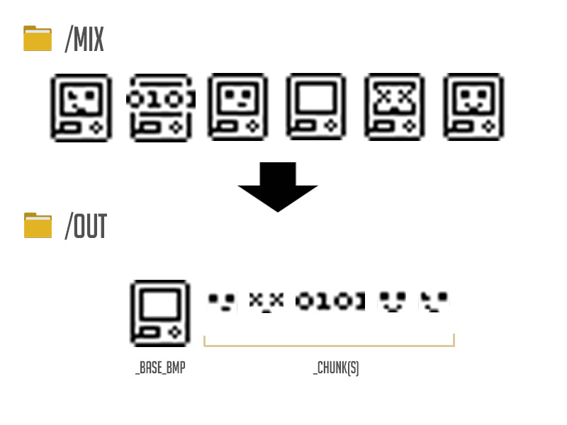

# Image Converter/Compressor for Embedded Devices

## **+ Description**
### [**8bbw2c.sh**](./8bbw2c.sh)
converts B/W image to 8-bit C/C++ array. Please note, the image should be **Black & White**, neither Grayscale nor in Color.

### [**16brgb2c.sh**](./16brgb2c.sh)
converts 16-bit color binary image into RGB565 C/C++ array.

### [**img2bin.sh**](./img2bin.sh)
converts images to binary or C/C++ RAW pixel array (RGB565 and RGB888). Tested only for .jpg and .png images for now.

#### **Saving PNGs in Adobe Illustrator:**

> File - Export As:
> 1. File format - PNG
> 2. Non-interlaced
> 3. Optimization - preferable "None"

#### **Bin header format:**

<table style="width:100%;">
    <thead>
        <tr>
        <th>#</th>
        <th>Name</th>
        <th>Length in bytes</th>
        </tr>
    </thead>
    <tbody>
        <tr>
            <td>1</td>
            <td>Compression (boolean)</td>
            <td>2</td>
        </tr><tr>
            <td>2</td>
            <td>Width</td>
            <td>2</td>
        </tr><tr>
            <td>3</td>
            <td>Height</td>
            <td>2</td>
        </tr><tr>
            <td>4</td>
            <td>Flag of alpha channel</td>
            <td>2</td>
        </tr><tr>
            <td>5</td>
            <td>Dominant (background) color</td>
            <td>2</td>
        </tr><tr>
            <td>6</td>
            <td>Color as Alpha channel</td>
            <td>2</td>
        </tr>
    </tbody>
</table>

 

>**PLEASE NOTE**: \
The above scripts are using <code>in</code>, <code>out</code> and <code>.tmp</code> directories in order to seek for a source and store the final result accordingly.

 

### [**mix8bbw2c.sh**](./mix8bbw2c.sh)
converts a few similar images into the dependant scructure of binary arrays. The script tries to find an image that has the most similarities with all the others and creates *_base_bmp array. Then converts all the other images to binary, excluding the *_base_bmp block. In principle the logic is diplayed on the image below.

In order to decode and display the binaries on the device you can use the following functions:

- **drawBmpRGB** - displays RGB565 bitmap graphic
- **drawBmpRGBA** - drawing an image that has alpha channel or use an alpha color
- **drawBmpBW** - drawing single 8-bit B/W compressed bitmap
- **drawBmpBWChunk** - drawing 8-bit B/W chunked compressed bitmap

The following is an example of encoded *(using mix8bbw2c.sh script)* B/W chunked bitmaps:

<pre><code>/**
 * fmt: 8-bit B/W chunked compressed image map
 * img: lcrtc7
 * bmp: lcrtc7_bmp (non-inverted)
 * gen: mix8bbw2c.sh (v.1.3) at 27.07.2020 20:07:25
*/
const uint8_t off_base_bmp[] PROGMEM = {
0xFF,0x02,0x00,0x0C,0xFF,0x03....
};

const chunk8b_t off_chunk PROGMEM = {
    off_base_bmp,
    0,
    16, 16, 0
};

const uint8_t alert_chunk_bmp[] PROGMEM = {
0x00,0x37,0x00,0x02,0x00,0x02...
};

const chunk8b_t alert_chunk PROGMEM = {
    off_base_bmp,
    alert_chunk_bmp,
    16, 16, 30
};

const uint8_t working_chunk_bmp[] PROGMEM = {
0x00,0x31,0x00,0x01,0xFF,0x01...
};

const chunk8b_t working_chunk PROGMEM = {
    off_base_bmp,
    working_chunk_bmp,
    16, 16, 108
};</cdoe></pre>

 

---
| 

 | Please refer to [issues](https://github.com/way5/bmp-compressor-for-embedded/issues) :beetle: if you have any suggestion or found an error. &nbsp; &nbsp; &nbsp; &nbsp; &nbsp; &nbsp; &nbsp; &nbsp; &nbsp; &nbsp; &nbsp; &nbsp; &nbsp; &nbsp; &nbsp; &nbsp; &nbsp; &nbsp; &nbsp; &nbsp; &nbsp; &nbsp; &nbsp; &nbsp; &nbsp; &nbsp; &nbsp; &nbsp; &nbsp; &nbsp; &nbsp; &nbsp; &nbsp; &nbsp; &nbsp; &nbsp; &nbsp; &nbsp; &nbsp; |
|:---:|:---|

